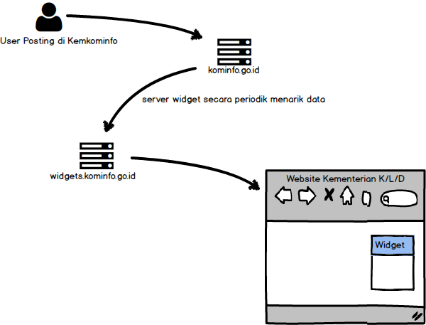
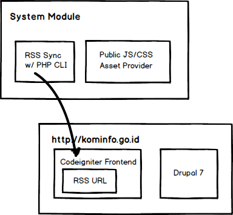
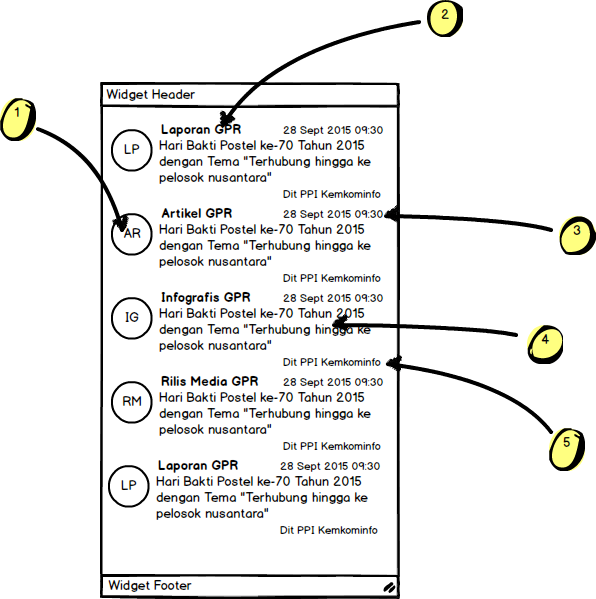

# Widget Sindikasi Kominfo

Sesuai dengan request dari Dirjen IKP tentang permintaan agar ada konten Government Public Relations yang dapat ditampilkan di website-website kementerian dan lembaga (K/L/D).

## Tentang Widget

Widget ini ditujukan untuk menampilkan data RSS Feed dalam Bentuk XML ke dalam widget yang dapat di copy-paste langsung di website K/L/D. Kurang lebih sama seperti twitter atau facebook widget, namun berisi berita GPR yang ada di Kemkominfo.


## Cara Kerja Sistem

Untuk alasan isolasi proses dan performa, maka kita akan membuat satu server baru dengan alamat `widget.kominfo.go.id`. Server ini akan menghandle semua static request baik secara data XML maupun resource Js, CSS dan Image.
Server ini juga akan diset untuk permissive secara Cross Origin Resource Sharing



Lebih detail lagi, Proses penarikan data `RSS/XML`secara berkala ini akan dilakukan via `GET` dari `widgets.kominfo.go.id` melalui cronjob.
Di bawah ini merupakan gambar detail penarikan data dari frontend CLI webkominfo.



## Struktur Widget

Untuk versi awal ini, hanya akan dibuat widget versi 3 kolom dari 12 kolom, dengan konten sbb:



1. Logo Kategori Konten GPR (laporan, infografis dst)
2. Teks Kategori Konten GPR (laporan, infografis, rilis media dst)
3. Waktu konten dibuat (pubDate)
4. Judul Konten
5. Author dari konten

## Development Guide

### Dependensi
* PHP >= 5.6
* Node >= 4.0.x
* Composer latest
* grunt-cli `npm -g install grunt-cli`

### Struktur Direktori

`public/src` digunakan untuk development sehari-hari, dengan js yang belum di gabung dan belum diminify

`public/build` berisi output dari `grunt`, digunakan sebagai entri poin dari js dan css widgets.

`sync` berisi script PHP yang digunakan untuk melakukan penarikan data RSS XML dari `kominfo.go.id`

### Setup

* `cp config.dev.js config.js` untuk membuat file konfigurasi grunt
* `cp sync/config.dev.php sync/config.php` untuk membuat konfigurasi sync
* `npm i -d && composer install` untuk inisialisasi dependensi npm dan composer

### How To Run

* jalankan `grunt` untuk menggenerate build terbaru pada lokasi `public/build`
* jalankan `php sync/run.php` untuk melakukan generate file local XML RSS pada lokasi `public/build/data/latest`. Command ini dapat dijalankan secara berkala via crontab untuk mengambil data terbaru dari kominfo.go.id

### Cross Origin Resource Sharing (CORS)

Untuk dapat berjalan dengan lancar, kita harus menambahkan header `Access-Control-Allow-Origin` dan `Access-Control-Allow-Headers` dan  pada konfigurasi di domain apache, agar dapat diakses dari origin server yang berbeda:

```txt
<VirtualHost *:80>
    ServerAdmin webmaster@dummy-host2.example.com
	 ServerName wbkprod
	 ServerAlias wbkprod
    DocumentRoot "/Users/donixo/htdocs/webkominfo-widget/public/build"
    ErrorLog "/private/var/log/apache2/wbk-prod-error_log"
	 <Directory "/Users/donixo/htdocs/webkominfo-widget/public/build">
		 AllowOverride All
		Allow from All
	 </Directory>

     <FilesMatch "\.(css|xml|ttf|eot|woff)$">
        <IfModule mod_headers>
            Header set Access-Control-Allow-Origin "*"
            Header set Access-Control-Allow-Headers "X-Requested-With"
        </IfModule>
    </FilesMatch>

    #Disable PHP
    <FilesMatch "(?i)\.php$">
        Order Allow,Deny
        Deny from all
    </FilesMatch>

</VirtualHost>
```
